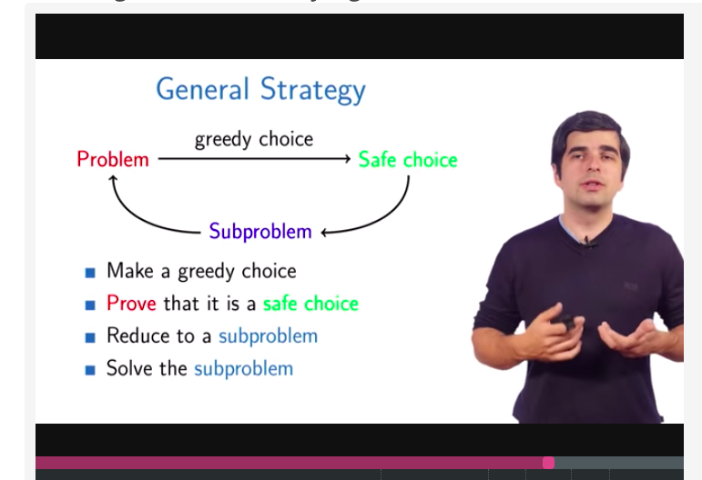
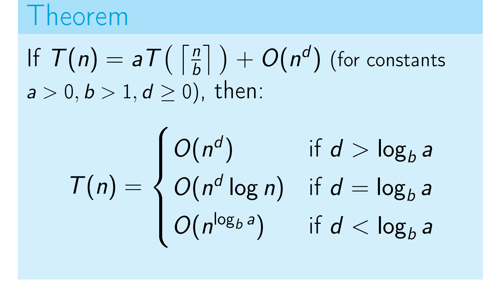

# Algorithmic Design and Techniques
## 1.Programming Challenges
### 1.1 Welcome
#### 1.1.1 welcome
#### 1.1.2 Programming challenges

##2. Algorithmic Warmup
### 2.1 Why Study Algorithms?
#### 2.1.1 Lecture: Why Study Algorithms?

##### Simple Programming Problems

- Has linear scan.
- Cannot do much better.
- The obvious program works.

##### Algorithms Problems

- Not clear how to do
- Simple ideas too slow
- Room for optimization

##### Artificial Intelligence Problems

- Hard to even clearly state.

##### What We’ll Cover

Focus on algorithms problems.:

- Clearly formulated.

- Hard to do efficiently

#### 2.1.2 Lecture: Coming Up

Cover two algorithm problems:

- Fibonacci Numbers

- Greatest Common Divisors

Examples of why algorithms are important.

Both of these problems have a pretty straightforward algorithm.

These very straightforward algorithms are far, far too slow.

### 2.2 Fibonacci Numbers

Learning Objectives:

- Understand the definition of the Fibonacci numbers.
- Show that the naive algorithm for computing them is slow.
- Efficiently compute large Fibonacci numbers

#### 2.2.1 Problem Overview

- Understand the definition of the Fibonacci numbers.
- Show that Fibonacci numbers become very large.

#### 2.2.2 Naive Algorithm

- Produce a simple algorithm to compute Fibonacci numbers.
- Show that this algorithm is very slow

#### 2.2.3 Efficient Algorithm

- Compute Fibonacci numbers efficiently.

#### 2.2.4 Summary

- Introduced Fibonacci numbers.
- Naive algorithm takes ridiculously long time on small examples.
- Improved algorithm incredibly fast.

***The right algorithm makes all the difference***

### 2.3 Greatest Common Divisor  

#### 2.3.1 Lecture: Problem Overview and Naive Algorithm

### 2.4 Big-O Notation

#### 2.4.1 Lecture: Computing Runtimes

**Problem**

- Figuring out accurate runtime is a h uge mess
- In practice, you might not even know some of these details

**want to** 

- Figuring out accurate runtime is a huge mess
- In practice, you might not even know some of these details

#### 2.4.2 Lecture: Asymptotic Notation

**Learning Objectives**

- Understand the basic idea behind asymptotic runtimes.
- Describe some of the advantages to using asymptotic runtimes.

#### 2.4.3 Lecture: Big-O Notation

**Learning Objectives**

- Understand the meaning of Big-O notation.
- Describe some of the advantages and disadvantages of using Big-O notation.

This has several advantages

1. Clarifies Growth Rate
2. Cleans up Notation
3. Can Ignore Complicated Details

Warning:

- Using Big-O loses important information about constant multiples.
- Big-O is only asymptotic.

#### 2.4.4 Lecture: Using Big-O

##### Learning Objectives

- Manipulate expressions involving Big-O and other asymptotic notation.
- Compute algorithm runtimes in terms of Big-O.

### 2.5 Course Overview

What can we teach you?

- Practice designing algorithms.
- Common tools used in algorithm design.

Levels of Design

- Naive Algorithm: Definition to algorithm. Slow.
- Algorithm by way of standard Tools: Standard techniques.
- Optimized Algorithm: Improve existing algorithm.
- Magic Algorithm: Unique insight.

## 3. Greedy Algorithms

### 3.1 Introduction  

#### 3.1.1 Largest Number

What’s Coming

- Solve salary maximization problem
- Come up with a greedy algorithm yourself
- Solve optimal queue arrangement problem
- Generalize solutions using the concepts of greedy choice, subproblem and safe choice

**Greedy Strategy**

1. Make some greedy choice
2. Reduce to a smaller problem
3. Iterate

**Safe Choice**

A greedy choice is called safe choice if there is an optimal solution consistent with this first choice.

### 3.2 Celebration Party  

### 3.3 Maximizing Loot  

##### 3.2.3 review

Main Ingredients：

- Safe choice
- Prove safety
- Solve subproblem
- Estimate running time

in my  opinion：

- safety greedy choice
- iterate solve subproblem
- estimate running time 

## 4. Divide-and-Conquer

### 4.1 introduction 

##### 4.1.1 intro

1. Break into non-overlapping subproblems of the same type
2. Solve subproblems
3. Combine results

##### 4.1.2 Linear Search

**Summary**

- Create a recursive solution
- Define a corresponding recurrence relation, T
- Determine T(n): worst-case runtime
- Optionally, create iterative solution

##### 4.1.3 Binary Search

**summary**

- Break problem into non-overlapping subproblems of the same type.
- Recursively solve those subproblems.
- Combine results of subproblems.

### 4.2 Master Theorem  

#### What is the Master Theorem?

T(n) = 4T(︁n/2)︁ + O(n)   Since d < logb a, T(n) = O(nlogb a) = O($n ^2$)

T(n) = 3T(︁n/2)︁ + O(n)   Since d < logb a, T(n) = O(nlogb a) = O($n^(log2^3)$)

T(n) = 2T(︁n/2)︁ + O(n)   Since d = logb a,    T(n) = O(nd log n) = O(n log n)

T(n) = T(︁n/2)︁ + O(1)     Since d = logb a, T(n) = O(nd log n) = O(n0 log n) = O(log n)

### 4.3 Sorting Problem  

####  Selection Sort

- Selection sort is an easy to implement algorithm with running time O(n2).
- Sorts in place: requires a constant amount of extra memory.
- There are many other quadratic time sorting algorithms: e.g., insertion sort,
  bubble sort.

#### merge Sort

The running time of MergeSort(A[1 . . . n]) is O(n log n).

#### Lower Bound for Comparison Based Sorting

Any comparison based sorting algorithm performs Ω(n log n) comparisons in the worst case to sort n objects.

#### Non-Comparison Based Sorting Algorithms

**Summary**

- Merge sort uses the divide-and-conquer strategy to sort an n-element array in time O(n log n).
- No comparison based algorithm can do this (asymptotically) faster.
- One can do faster if something is known about the input array in advance (e.g., itcontains small integers).

### 4.4 Quick Sort  

- Quick sort is a comparison based algorithm
- Running time: O(n log n) on average, O(n2) in the worst case
- Efficient in practice

## 5. Dynamic programming1

### 5.1 change problem

#### 5.1.1 change problem